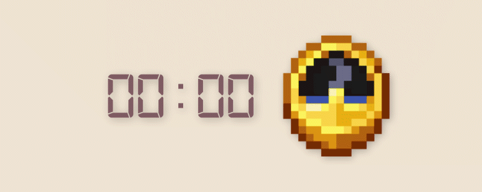

# Minecraft Style Clock

A website showing time, but in Minecraft style :3

I believe this project is self-explanatory, it's just a website that displays the time as Minecraft clock.

This project started as a simple experiment in selecting the correct clock frame based on time…  
Then it got animations…  
Then timezone support…  
Until it became a fun little website.

## Live Demo

[Click here to check it live!](https://mcclock.azizcloud.dev/)

## Features
- **Dynamic Clock**: Shows the Minecraft clock based on your system's time!
- **Fun Animations** Shows clock animation similar to the game.
- **Clock Generation**: Enter your time to generate synced Minecraft clock frame.
- **Lightweight & Fast**: Fully static website.

## Technologies Used

> *"An idiot admires complexity, a genius admires simplicity"* - Terry A. Davis

This is a pure frontend project that displays a Minecraft-style clock synced with real time.  

No frameworks, no libraries. just pure **HTML**, embedded **JavaScript** and **CSS**.

